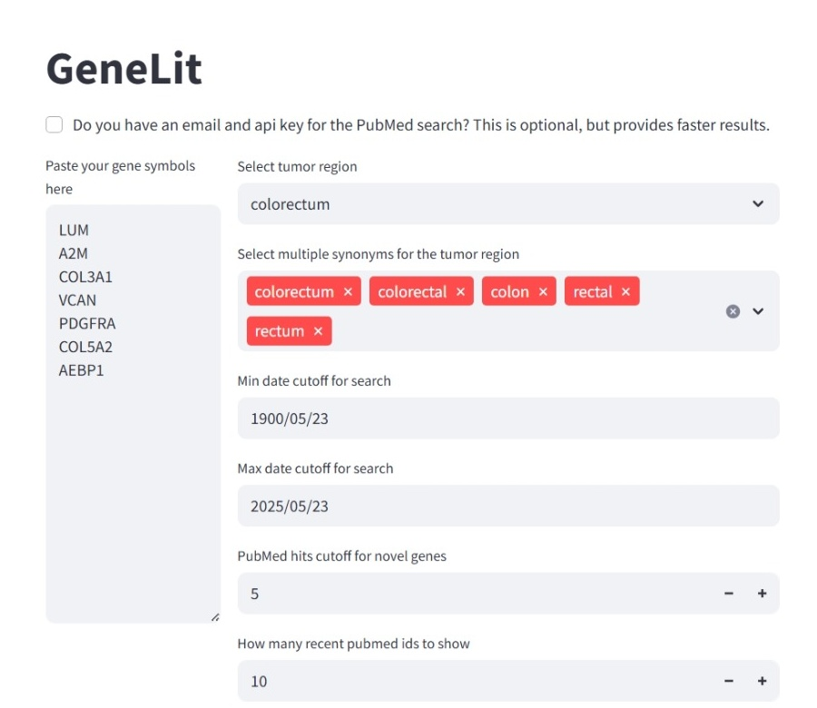
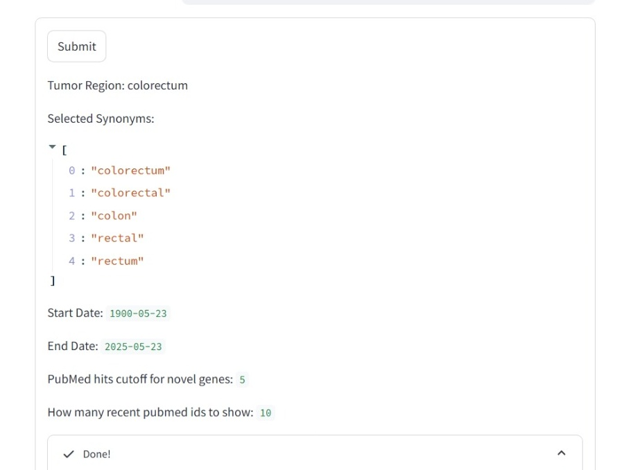

# GeneLit 🧬🔎

**GeneLit** is a small but handy tool we built to help scientists quickly perform a literature review on a set of genes associated with a particular cancer type.

## 🔗 Live App

👉 Try it here: [GeneLit on Streamlit Cloud](https://genelit.streamlit.app/) 

## Why we built it

In our own cancer biomarker research, we often found ourselves manually checking PubMed for gene relevance — a repetitive and slow process. So we created **GeneLit**: a fast, minimal tool to generate a **PubMed literature status** for a list of genes, with filters for cancer type, synonyms, and publication dates.

> Use GeneLit to:  
> ✅ Check how well-studied each gene is  
> ✅ Find novel or under-reported genes  

Follow up with pathway analysis tools like [ShinyGO](http://bioinformatics.sdstate.edu/go/) and look for those **novel genes** in the enriched pathways.

## Features

- 📄 Easy-to-fill input form for genes, cancer type, and time range  
- 📬 Optional email and API key input for faster PubMed querying  
- 🔁 Automatic retries on occasional network failures  
- 📊 Clean output with novel gene indication and recent PubMed IDs  

## Screenshots

**1. Input form**  


**2. Input summary**  


**3. Results table with retry support**  


## 💻 How to run locally

1. **Clone the repository**

   ```bash
   git clone https://github.com/subhajitbn/genelit.git
   cd genelit
   ```

2. **Create a virtual environment (optional but recommended)**

   ```bash
   python -m venv venv
   source venv/bin/activate  # On Windows: venv\Scripts\activate
   ```

3. **Install dependencies**

   ```bash
   pip install -r requirements.txt
   ```

4. **Run the app**

   ```bash   
   streamlit run app.py
   ```

## A community contribution ❤️

We hope **GeneLit** saves time and helps researchers focus more on biology and less on the browser.  
If it helps you — or if you improve it — feel free to star ⭐, fork 🍴, or contribute 🤝.  
Let’s make literature review a little easier for all.
